# 6Bites 🍔🍕

**6Bites** is a food delivery app inspired by StackFood, built using **Flutter**. It is designed to be adaptive and responsive, providing a seamless experience across **Android**, **Linux**, and **Web** platforms. The app uses **MediaQuery** and adaptive design principles to ensure it looks great on both mobile and desktop devices. It also leverages **GetX** for efficient state management, dependency injection, and navigation.

---

## Features 🌟

- **Cross-Platform**: Works on Android, Linux, and Web.
- **Adaptive UI**: Responsive design for both mobile and desktop views.
- **State Management**: Built with **GetX** for efficient and scalable state management.
- **Easy Navigation**: Intuitive and user-friendly interface powered by GetX.
- **Fast Performance**: Built with Flutter for smooth and fast performance.
- **Customizable**: Easily extendable for additional features.

---

## Adaptive UI in Action 🎥

Check out how **6Bites** adapts to different screen sizes and devices, including Android, iPhone, and Mac:

---

## Screenshots 📸

### Mobile View (APK)
| 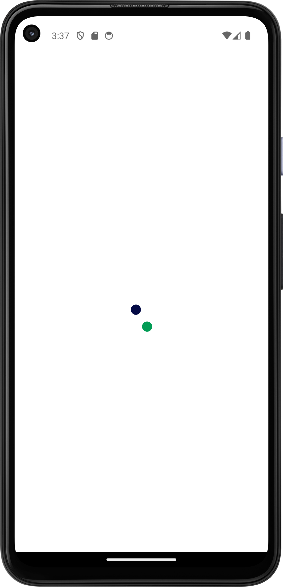 | 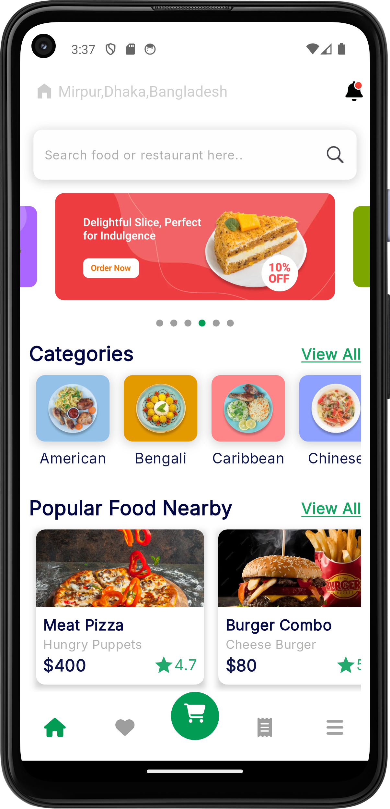 | 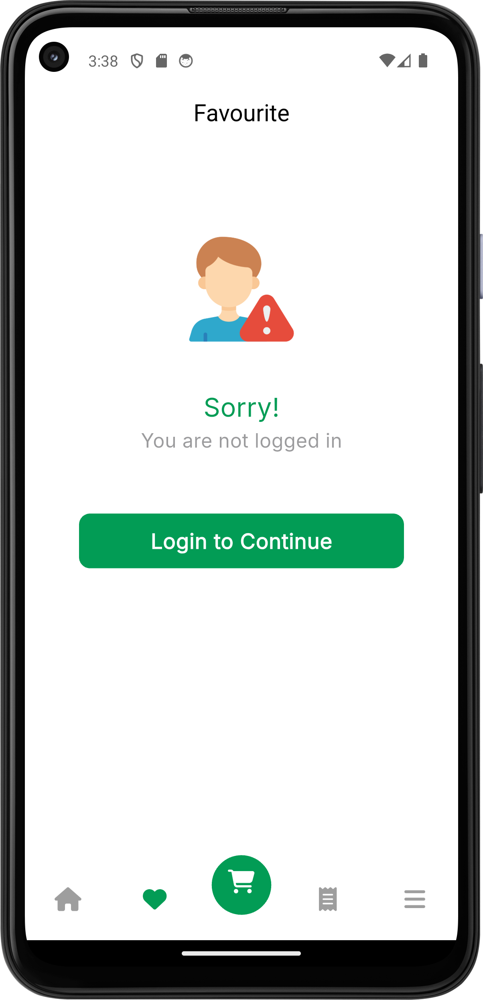 |
|------------------------------------|------------------------------------|------------------------------------|
| 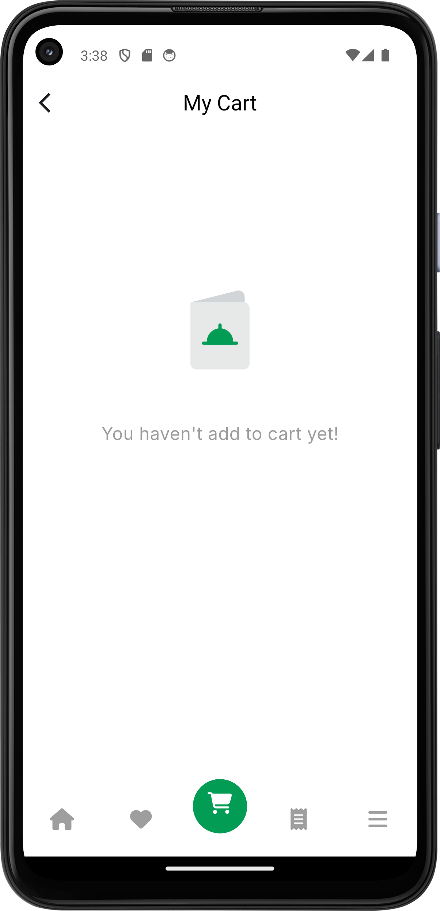 | 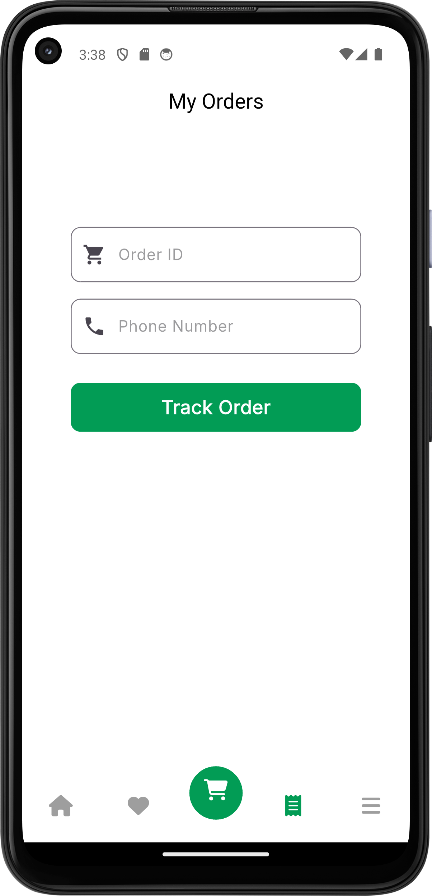 | 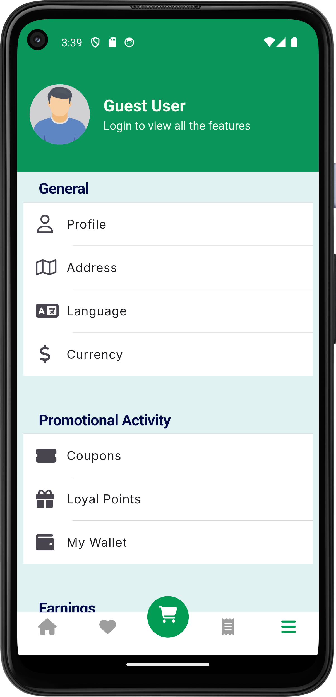 |

### Desktop View (Web View)
| 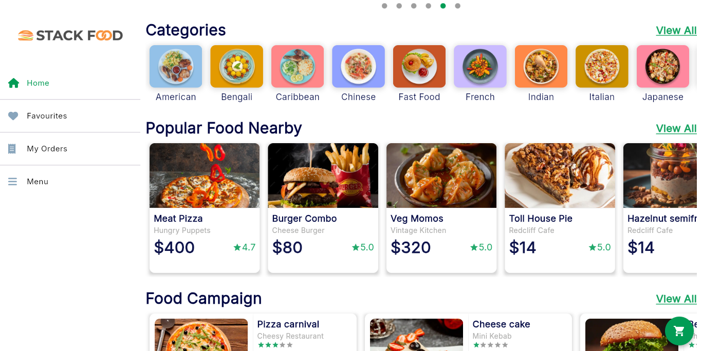 | 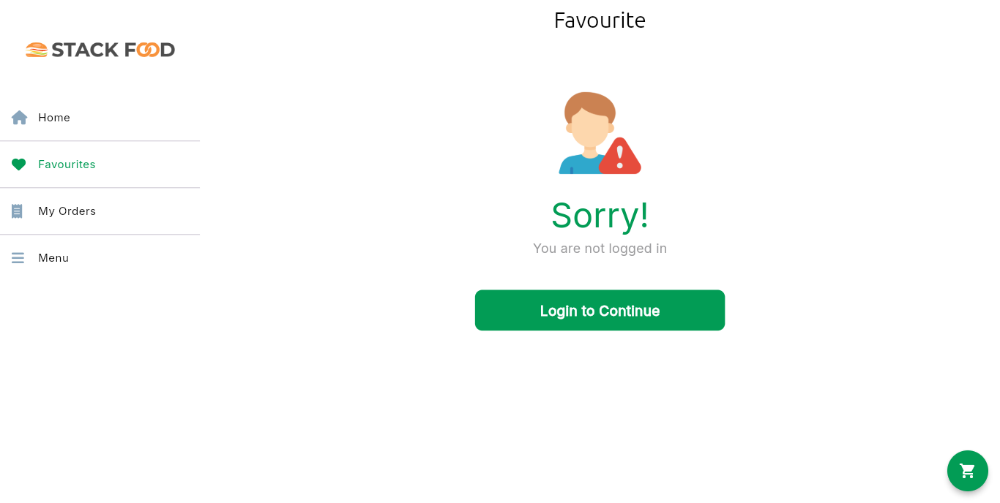 | 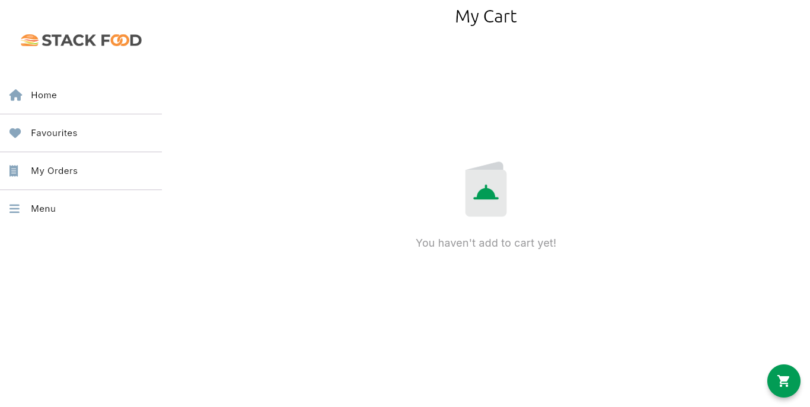 |
|--------------------------------------|--------------------------------------|--------------------------------------|
| 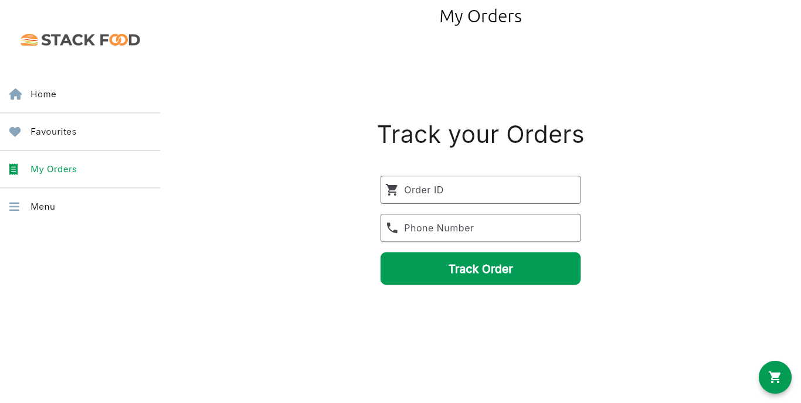 | 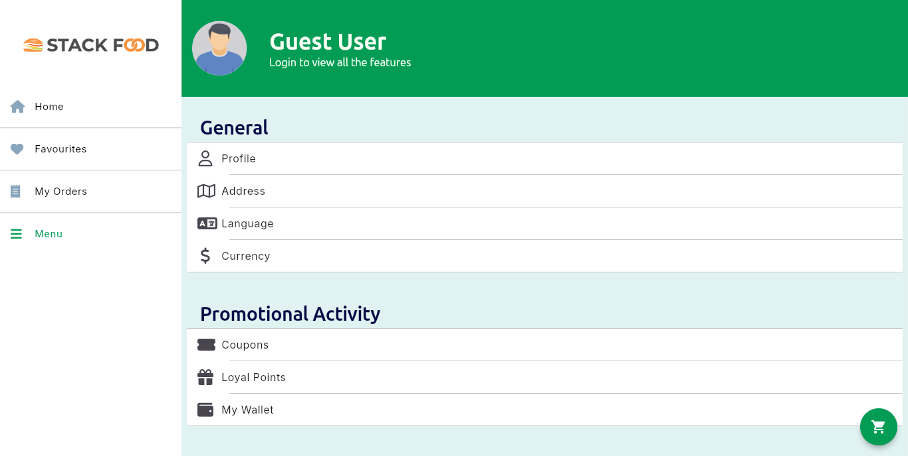 |                                      |

---

## Getting Started 🚀

### Prerequisites
- Flutter SDK (version 3.0 or higher)
- Dart (version 2.17 or higher)
- Android Studio or VS Code (with Flutter and Dart plugins installed)
- Chrome (for web testing)

### Download Links 📥
- **[Download APK](https://drive.google.com/file/d/1USvLZ9UBrdN_0VvoJFFf3o8LOkhsT4rU/view?usp=sharing)** for Android
- **[Download Linux Version](https://drive.google.com/file/d/1aQXiMnG8Y1qiK9YJFZyqmNzVf7YQklZS/view?usp=sharing)** 🐧 *for Linux (to run Just Click on sixbites)*
- **[Live Web Version](https://6-bites.vercel.app/)** 🌐 *(Note: Due to CORS restrictions, images from the API may not load in the web version.)*  

---

@ Shadman Sakib Mahee
